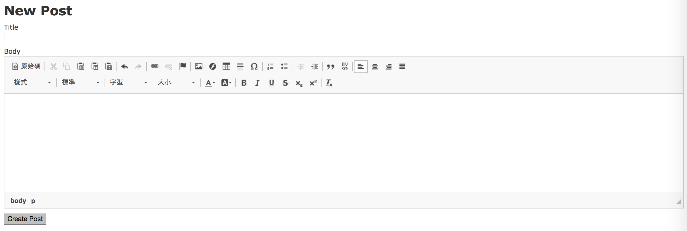
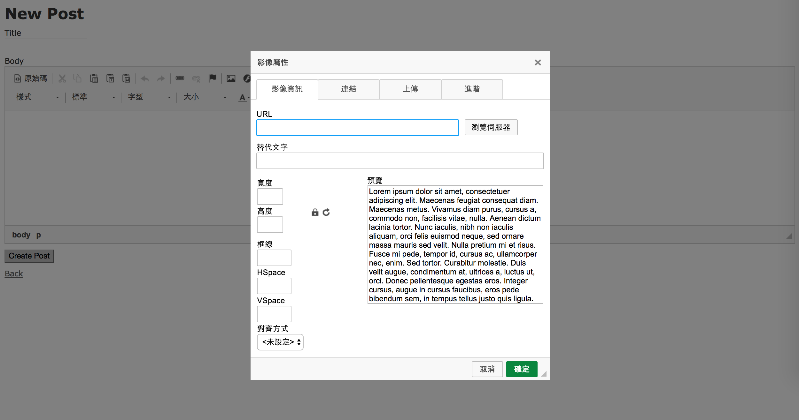
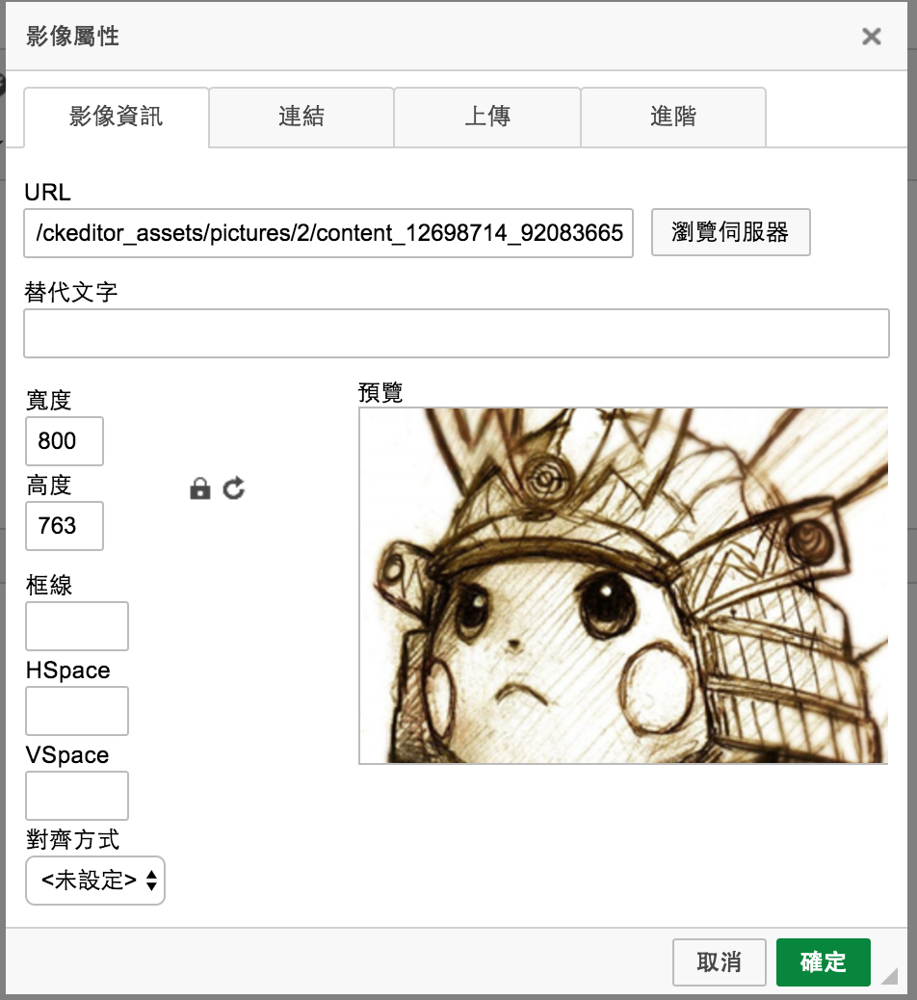
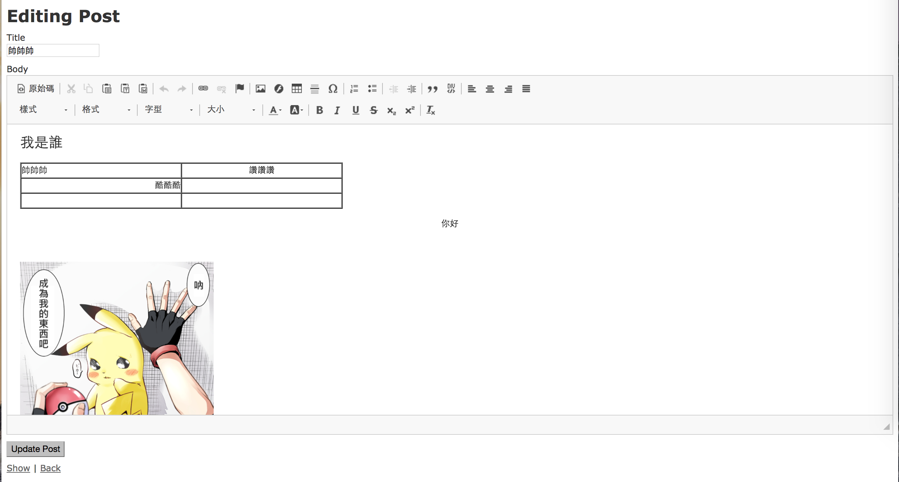
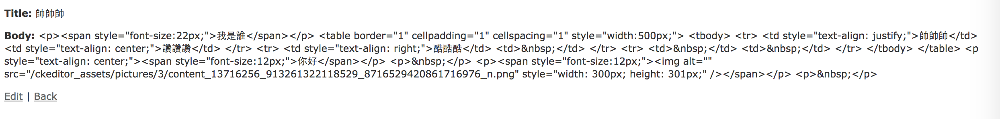
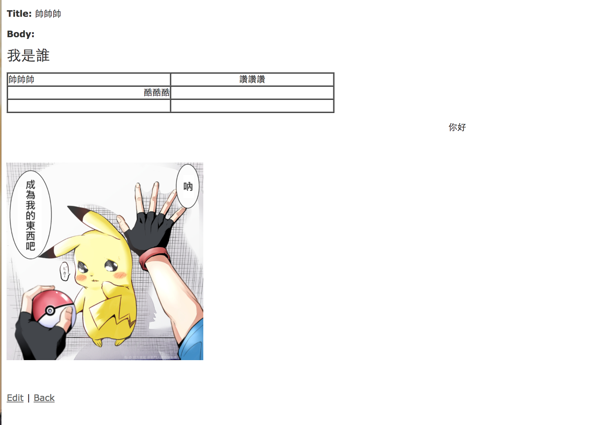

# 設定paperclip + ckeditor

參考
- [How to Install and Use Ckeditor and Paperclip in Rails App - Yu-Chieh’s Blog (Y.C. Chang)](http://andystu.github.io/blog/2015/02/26/how-to-install-and-use-ckeditor-and-paperclip-in-rails-app/)
- [Rails 4.0 ckeditor + paperclip - 我在ALPHACamp 52天 ~ 史蒂芬.陳的碎碎念](http://stevenchentw.blogspot.tw/2016/04/rails-40-ckeditor-paperclip-alphacamp-52.html)
- [ckeditor wiki - ActiveRecord + Paperclip](https://github.com/galetahub/ckeditor/wiki/Installation:-ActiveRecord#activerecord--paperclip)
- [paperclip README - Installation](https://github.com/thoughtbot/paperclip#installation)

add to `Gemfile`, and then `bundle install`
```
gem 'paperclip', "~> 5.0.0"
gem 'ckeditor'
```

ActiveRecord的設定
- [ckeditor README - ActiveRecord + paperclip](https://github.com/galetahub/ckeditor#activerecord--paperclip)

and then

```
rails generate ckeditor:install --orm=active_record --backend=paperclip
```

and then `rake db:migrate`

Models are autoloaded in Rails 4，不需要像[Rails 4.0 ckeditor + paperclip - 我在ALPHACamp 52天 ~ 史蒂芬.陳的碎碎念](http://stevenchentw.blogspot.tw/2016/04/rails-40-ckeditor-paperclip-alphacamp-52.html) 一樣寫`config.autoload_paths`
- [ckeditor README - Load generated models](https://github.com/galetahub/ckeditor#load-generated-models)

~~但用gem裝的ckeditor依舊要在`routes.rb`裡`mount Ckeditor::Engine => '/ckeditor'`~~

經實測，在我們寫`rails generate ckeditor:install --orm=active_record --backend=paperclip`，就會自動在`routes.rb`幫我們設定好`mount Ckeditor::Engine => '/ckeditor'`

# 使用ckeditor

主要參考
- [ckeditor README - Usage](https://github.com/galetahub/ckeditor#usage)

add to `app/assets/javascripts/application.js`

```
//= require ckeditor/init
```

用scaffold快速建好model

```
rails g scaffold post title:string body:text
```

and then `rake db:migrate`

然後修改`app/views/posts/_form.html.erb`

```
<%= form_for(@post) do |f| %>
  ...
  <div class="field">
    <%= f.label :body %><br>
    <%= f.cktext_area :body %>
  </div>
  <div class="actions">
    <%= f.submit %>
  </div>
<% end %>

```

然後去`http://localhost:3000/posts/`，新增一張表單，就能看到WYSIWYG



上傳圖片





編輯時的畫面




編輯完送出表單後你會發現，出來的結果怪怪的，怎麼都是HTML tag



於是我去改掉scaffold生出來的`show`與`index`的views

讓show頁面可以顯示ckeditor的完整內容
- [rails API - raw](http://api.rubyonrails.org/classes/ActionView/Helpers/OutputSafetyHelper.html#method-i-raw)
- [example-rails-ckeditor-uploader/example_ckeditor/app/views/posts/show.html.erb](https://github.com/JokerCatz/example-rails-ckeditor-uploader/blob/master/example_ckeditor/app/views/posts/show.html.erb)

fix `app/views/posts/show.html.erb`

```
...

<p>
  <strong>Body:</strong>
  <%= raw(@post.body) %>
</p>

...
```

>PS：上面這寫法是有危險性的，請見：[别用 raw 和 html_safe · Ruby China](https://ruby-china.org/topics/16633)
>
>我個人實測用`raw`、`html_safe`可以看到ckeditor的效果，若是用`simple_format`、`sanitize`則無法

scaffold生成的index頁面，會顯示該篇post的body，所以我們把它關掉

fix `app/views/posts/index.html.erb`

完整code
```
<p id="notice"><%= notice %></p>

<h1>Listing Posts</h1>

<table>
  <thead>
    <tr>
      <th>Title</th>
      <!-- <th>Body</th> -->
      <th colspan="3"></th>
    </tr>
  </thead>

  <tbody>
    <% @posts.each do |post| %>
      <tr>
        <td><%= post.title %></td>
        <!-- <td><%= post.body %></td> -->
        <td><%= link_to 'Show', post %></td>
        <td><%= link_to 'Edit', edit_post_path(post) %></td>
        <td><%= link_to 'Destroy', post, method: :delete, data: { confirm: 'Are you sure?' } %></td>
      </tr>
    <% end %>
  </tbody>
</table>

<br>

<%= link_to 'New Post', new_post_path %>
```

然後就能順利顯示我們剛剛用ckeditor撰寫的文章了


